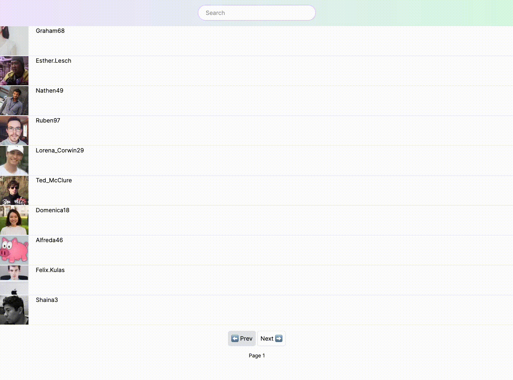

## Stonks Frontend Assignment

#### Demo

#### Instructions 

Only use Next.js/React library; Tailwind CSS is accepted for styling.
Your code must be clean and custom hooks are nice to have.

Data table: [Tanstack Table and Shadcn is accepted]
Create a CRUD that is SSR. You will use this endpoint to fetch data: https://665621609f970b3b36c4625e.mockapi.io/users

Documentation for filters, pagination, and limit is here https://github.com/mockapi-io/docs/wiki

Users can navigate from page 1 to 5.
Users can search by email/username.
Rewrite the current URL with the current page and filters. Multiple filters can be applied.
Chat
A simple message list of users. If someone tags you, a light background should be added to the message. If the message contains :emoji:, it should be replaced by the correct image.

[CHAT] Emojis
In the message input, if the user starts writing an :emoji:, a popup/tooltip or panel of emojis will appear, and the user can choose one using the keyboard and mouse.

[CHAT] Tag a user
In the message input, if the user starts writing @, a list of at least 3 users will appear.

Add filter logic so that if the user wants to tag @edeuxk and writes @edxk, the module should be smart enough to retrieve @edeuxk.

[CHAT] Commands
In the message input, if the user starts writing /, we should provide a list of actions. For now, we will only support the following actions:

/mute @user
/ban @user
/title set a title for the current stream
/description set a description for the current stream
Bonus
Modal needs to fit on every screen size, including resizing and scrolling inside. If the user presses escape, it needs to close the modal.

Profile picture upload/edit Select a picture from the disk file, resize and upload the selected area. Compression is required, and the image should be less than 550kb. The user does not have to be restricted; it will be compressed by the computer and saved as a PNG. The user can select SVG/PNG/JPEG. Note that iOS stores images as .heic, so be aware of that - [3rd party library accepted].